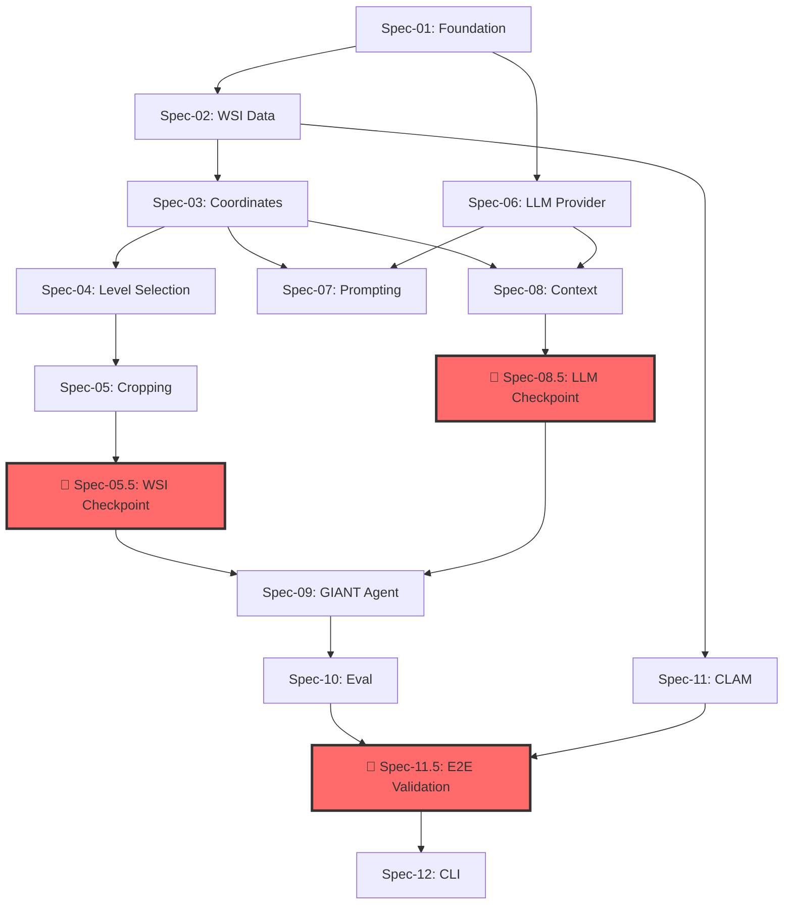

# GIANT Implementation Specifications

This directory contains the detailed technical specifications for implementing the GIANT (Gigapixel Image Agent for Navigating Tissue) framework.

> **⚠️ CRITICAL: Data Acquisition Required**
>
> Before running benchmarks, you must acquire **862 unique WSI files (~95-135 GB)** from TCGA, GTEx, and PANDA.
> The MultiPathQA CSV contains only metadata - the slides themselves are not included.
>
> - **TCGA:** 474 `.svs` files (for 3 benchmarks: cancer diagnosis, expert VQA, slidebench)
> - **GTEx:** 191 `.tiff` files (organ classification)
> - **PANDA:** 197 `.tiff` files (prostate grading)
>
> **See: [DATA_ACQUISITION.md](../DATA_ACQUISITION.md)** for download instructions and file lists.

## Specification Index

The specifications are designed to be implemented in sequential order, building a vertical slice of the system.

| Spec ID | Title | Status | Dependencies |
|---------|-------|--------|--------------|
| [Spec-01](./spec-01-foundation.md) | Project Foundation & Tooling | Ready | None |
| [Spec-02](./spec-02-wsi-data.md) | WSI Data Layer & OpenSlide Integration | Ready | Spec-01 |
| [Spec-03](./spec-03-coordinates.md) | Coordinate System & Geometry | Ready | Spec-02 |
| [Spec-04](./spec-04-level-selection.md) | Pyramid Level Selection Algorithm | Ready | Spec-02, Spec-03 |
| [Spec-05](./spec-05-cropping.md) | Image Cropping & Resampling Pipeline | Ready | Spec-04 |
| **[Spec-05.5](./spec-05.5-wsi-integration-checkpoint.md)** | **🛑 WSI Integration Checkpoint** | **PAUSE** | Spec-02 → Spec-05 |
| [Spec-06](./spec-06-llm-provider.md) | LLM Provider Abstraction | Ready | Spec-01 |
| [Spec-07](./spec-07-navigation-prompt.md) | Navigation Prompt Engineering | Ready | Spec-06, Spec-03 |
| [Spec-08](./spec-08-context-manager.md) | Conversation Context Manager | Ready | Spec-03, Spec-06 |
| **[Spec-08.5](./spec-08.5-llm-integration-checkpoint.md)** | **🛑 LLM Integration Checkpoint** | **PAUSE** | Spec-06 → Spec-08 |
| [Spec-09](./spec-09-giant-agent.md) | GIANT Agent Core Loop | Ready | Spec-05.5, Spec-08.5 |
| [Spec-10](./spec-10-evaluation.md) | Evaluation & Benchmarking Framework | Ready | Spec-09 |
| [Spec-11](./spec-11-clam-integration.md) | CLAM Integration (Optional) | Ready | Spec-02 |
| **[Spec-11.5](./spec-11.5-e2e-validation-checkpoint.md)** | **🛑 E2E Validation Checkpoint** | **PAUSE** | Spec-09 → Spec-11, DATA_ACQUISITION |
| [Spec-12](./spec-12-cli-api.md) | CLI & API Surface | Ready | Spec-11.5 |

## TDD Principles (Non-Negotiable)

This project follows strict TDD as per Uncle Bob's Clean Code:

1.  **Red-Green-Refactor**: Write failing test first, make it pass, then refactor
2.  **SOLID Principles**:
    -   **Single Responsibility**: Each class does one thing
    -   **Open/Closed**: Extend via protocols, not modification
    -   **Liskov Substitution**: Subtypes must be substitutable
    -   **Interface Segregation**: Small, focused protocols
    -   **Dependency Inversion**: Depend on abstractions (Protocols)
3.  **Gang of Four Patterns Used**:
    -   **Strategy**: LLMProvider, LevelSelector
    -   **Factory**: Provider creation from config
    -   **Template Method**: Agent run loop
    -   **Observer**: Trajectory recording
4.  **Test Coverage**: Minimum 90% enforced in CI
5.  **Mutation Testing**: Run `make mutmut` before PRs

All new code MUST have tests written FIRST.

## Implementation Dependency Graph

**Critical Path:** Spec-01 → Spec-02 → ... → Spec-05 → **🛑 Spec-05.5** → Spec-06 → ... → Spec-08 → **🛑 Spec-08.5** → Spec-09 → Spec-10 → **🛑 Spec-11.5** → Spec-12

## Integration Checkpoints

These are **mandatory pause points** before proceeding:

| Checkpoint | Purpose | Duration | Cost |
|------------|---------|----------|------|
| **Spec-05.5** | Verify WSI pipeline works end-to-end with real `.svs` files | 2-4 hours | Free |
| **Spec-08.5** | Verify LLM pipeline works with real API calls | 2-4 hours | ~$2-5 |
| **Spec-11.5** | Verify full system works on MultiPathQA benchmark data | 4-8 hours | ~$5-50 |

**DO NOT skip these checkpoints.** Debugging issues in the CLI/API layer (Spec-12) is 10x harder than catching them here.

> **Lesson Learned:** We should validate against real benchmark data at each checkpoint, not just after all specs are implemented. Unit tests with mocks are necessary but not sufficient.
