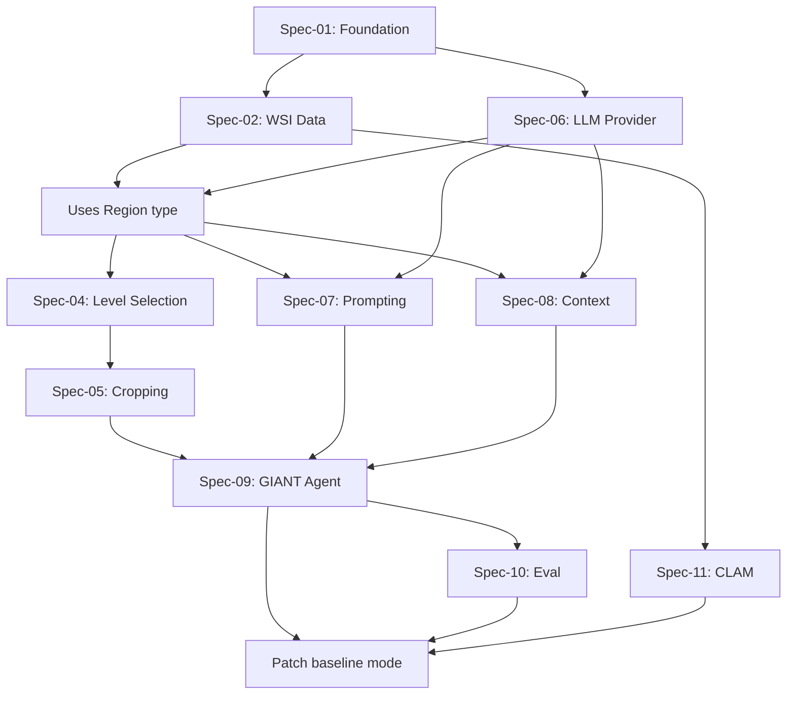

# GIANT Implementation Specifications

This directory contains the detailed technical specifications for implementing the GIANT (Gigapixel Image Agent for Navigating Tissue) framework.

## Specification Index

The specifications are designed to be implemented in sequential order, building a vertical slice of the system.

| Spec ID | Title | Status | Dependencies |
|---------|-------|--------|--------------|
| [Spec-01](./spec-01-foundation.md) | Project Foundation & Tooling | Ready | None |
| [Spec-02](./spec-02-wsi-data.md) | WSI Data Layer & OpenSlide Integration | Ready | Spec-01 |
| [Spec-03](./spec-03-coordinates.md) | Coordinate System & Geometry | Ready | Spec-02 |
| [Spec-04](./spec-04-level-selection.md) | Pyramid Level Selection Algorithm | Ready | Spec-02, Spec-03 |
| [Spec-05](./spec-05-cropping.md) | Image Cropping & Resampling Pipeline | Ready | Spec-04 |
| [Spec-06](./spec-06-llm-provider.md) | LLM Provider Abstraction | Ready | Spec-01 |
| [Spec-07](./spec-07-navigation-prompt.md) | Navigation Prompt Engineering | Ready | Spec-06, Spec-03 |
| [Spec-08](./spec-08-context-manager.md) | Conversation Context Manager | Ready | Spec-03, Spec-06 |
| [Spec-09](./spec-09-giant-agent.md) | GIANT Agent Core Loop | Ready | Spec-05, Spec-07, Spec-08 |
| [Spec-10](./spec-10-evaluation.md) | Evaluation & Benchmarking Framework | Ready | Spec-09 |
| [Spec-11](./spec-11-clam-integration.md) | CLAM Integration (Optional) | Ready | Spec-02 |
| [Spec-12](./spec-12-cli-api.md) | CLI & API Surface | Ready | Spec-09, Spec-10, Spec-11 |

## TDD Principles (Non-Negotiable)

This project follows strict TDD as per Uncle Bob's Clean Code:

1.  **Red-Green-Refactor**: Write failing test first, make it pass, then refactor
2.  **SOLID Principles**:
    -   **Single Responsibility**: Each class does one thing
    -   **Open/Closed**: Extend via protocols, not modification
    -   **Liskov Substitution**: Subtypes must be substitutable
    -   **Interface Segregation**: Small, focused protocols
    -   **Dependency Inversion**: Depend on abstractions (Protocols)
3.  **Gang of Four Patterns Used**:
    -   **Strategy**: LLMProvider, LevelSelector
    -   **Factory**: Provider creation from config
    -   **Template Method**: Agent run loop
    -   **Observer**: Trajectory recording
4.  **Test Coverage**: Minimum 90% enforced in CI
5.  **Mutation Testing**: Run `make mutmut` before PRs

All new code MUST have tests written FIRST.

## Implementation Dependency Graph

**Critical Path:** Spec-01 → Spec-02 → Spec-03 → Spec-04 → Spec-05 → Spec-09 → Spec-12
